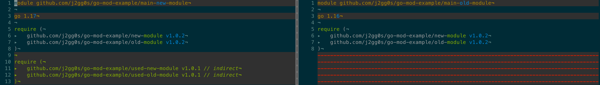
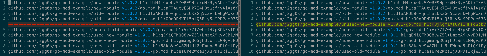

# ``go mod tidy --compat 1.17`` 的实际影响详解

被 [module graph pruning](Module graph pruning) 中的长难句绕的有点晕,
所以写了点例子来验证自己的理解.

## 项目结构

```
tree -d
.
├── main-new-module
├── main-old-module
├── new-module
│   ├── unused
│   └── used
├── old-module
│   ├── unused
│   └── used
├── unused-new-module
│   └── unused
├── unused-old-module
│   └── unused
├── used-new-module
│   └── used
└── used-old-module
    └── used

16 directories
```

- old 指代使用 go1.16, new 指代使用 go1.17
- new-module/old-module 是 main-new-module/main-old-module 的直接依赖
- used-new-module/used-old-module/unused-new-module/unused-old-module 是间接依赖


## go.mod

go1.16 仅会将直接依赖保存在 go.mod 文件中, go1.17 开始会额外的用一个单独的 requre block 来存储项目的间接依赖.

``vimdiff main-new-module/go.mod main-old-module/go.mod``


## go.sum

相较于 go1.16 的 go.sum 文件, go1.17 中不包括 unused-new-module.
这是因为经过 go1.17 引入 [module graph pruning]() 后, 不会再记录未实际使用的间接依赖 module.
而 unused-old-module 中的任何代码虽然没有被 main-new-module 使用到,
但是因为引入 unused-old-module 的 old-module 依然使用 go1.16, 所以不受 go1.17 才引入的新 feature 的影响.

``vimdiff main-new-module/go.sum main-old-module/go.sum``


如果希望 go.sum 中使用 go1.17 的紧凑模式:
- go 的版本需要大于等于 1.17
- 而且当 go 的版本为 1.17 时需要额外参数 --compat=1.17, 这是因为 go1.17 的默认行为和 go1.16 保持了一致.
